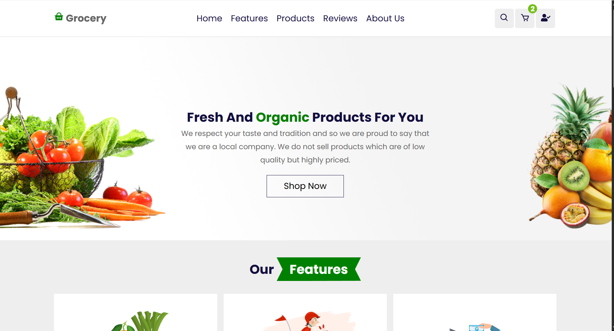

# 🛒 Smart Bazaar

<p align="center">
  <strong>A Full-Stack MERN Grocery Shopping Platform</strong><br>
  Built with MongoDB, Express.js, React.js, Node.js, Redux, JWT Authentication, Cloudinary, and deployed on Vercel & Render.
</p>

---

## 🌐 Live Demo

- **Frontend:** https://smart-bazaar-nine.vercel.app
- **Backend API:** https://smart-bazaar.onrender.com


---

# ✨ Features

### 👤 User Features

- 🔐 Secure Login & Registration
- 🔑 Forgot Password & Password Reset via Email
- 👤 User Profile Management
- 🛍 Browse Products
- 🔍 Search Products
- 🗂 Filter Products by Category & Price
- 🛒 Add Products to Cart
- 📦 Place Orders
- 📄 View Order History
- ⭐ Submit Product Reviews

### 👨‍💼 Admin Features

- Dashboard
- Product Management (CRUD)
- Category Management
- User Management
- Order Management
- Review Management

---

# 🚀 Tech Stack

### Frontend

- React.js
- Redux
- React Router
- Axios
- CSS3
- Material UI
- React Icons
- Swiper.js

### Backend

- Node.js
- Express.js
- MongoDB
- Mongoose
- JWT Authentication
- bcrypt
- Nodemailer
- Cloudinary

### Deployment

- Frontend → Vercel
- Backend → Render
- Database → MongoDB Atlas

---

# 📂 Project Structure

```text
Smart_Bazaar/
│
├── backend/
│   ├── Controllers/
│   ├── Models/
│   ├── Routes/
│   ├── Middleware/
│   └── index.js
│
├── frontend/
│   ├── src/
│   ├── public/
│   └── package.json
│
└── README.md
```

---

# ⚙️ Installation

### Clone Repository

```bash
git clone https://github.com/Subhranta703/Smart_Bazaar.git

cd Smart_Bazaar
```

---

### Install Backend

```bash
npm install
```

---

### Install Frontend

```bash
cd frontend
npm install
```

---

# 🔑 Environment Variables

Create a `.env` file inside the backend directory.

```env
MONGODB_URI=your_mongodb_uri

JWT_SECRET_KEY=your_jwt_secret

JWT_RESET_PASSWORD_SECRET_KEY=your_reset_secret

COOKIE_EXPIRE=5

SMPT_MAIL=your_email

SMPT_PASSWORD=your_password

CLOUD_NAME=your_cloudinary_name

CLOUD_API_KEY=your_cloudinary_key

CLOUD_API_SECRET_KEY=your_cloudinary_secret
```

---

# ▶️ Run Locally

### Backend

```bash
npm run dev
```

### Frontend

```bash
cd frontend
npm start
```

Application runs at:

```
http://localhost:3000
```

---

# 📸 Screenshots



---

# 🎯 Future Improvements

- Online Payment Integration
- Wishlist Feature
- Product Recommendations
- Order Tracking
- Email Notifications
- Admin Analytics Dashboard
- Responsive Admin Dashboard
- PWA Support

---

# 👨‍💻 Author

**Subhranta Kumar Nayak**

- GitHub: https://github.com/Subhranta703
- LinkedIn: https://www.linkedin.com/in/subhranta-kumar-nayak-8917521b6/

---

## ⭐ Support

If you found this project useful, consider giving it a ⭐ on GitHub.

It helps others discover the project and motivates future improvements.

---

Made with ❤️ using the MERN Stack.